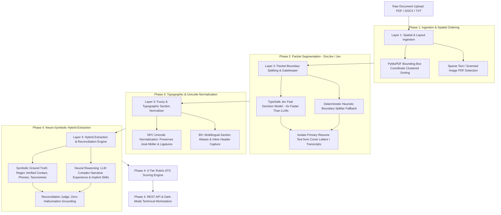

# ATS Resume Parser & Match Engine — Master Study Documentation

**Author & Creator:** SazWhatician  
**Project:** Local-First ATS Resume Parser & 4-Layer Adaptive Evaluation Engine  
**System Status:** `Phase 1: Completed 🟢` | `Phase 2: Completed 🟢` | `Phase 3: Completed 🟢` | `Phase 4: Completed 🟢`

---

## 🧭 Master Phase Directory (The 4 Adaptive Layers)

This learning curriculum is organized **strictly phase-wise** to provide an educational masterclass on how to build high-performance, real-world document intelligence systems. Every document includes a **Layman's Analogy**, deep **Computer Science Theory**, a **File-by-File Breakdown**, and **Career Skill-Up Takeaways**.

| Phase & Layer | Milestone & Architecture Focus | Key Objective & Real-World Edge Case | Status | Learning Guide |
| :---: | :--- | :--- | :---: | :--- |
| **Phase 1** *(Layer 1)* | **Spatial & Layout-Aware Document Ingestion** | Solves the "2-column word salad" problem using PyMuPDF bounding-box geometry; sorts sidebars vs body; detects scanned PDFs. | `🟢 Completed` | [phase-1.md](file:///c:/Users/saswa/Desktop/parse%20ATS/study_docs/phase-1.md) |
| **Phase 2** *(Layer 2)* | **Packet Boundary Splitting & Document Gatekeeping** | Uses DocJev / TypeSafe Jev decision models to split multi-page bundles (*Cover Letter + Resume + Transcripts*) and isolate resumes. | `🟢 Completed` | [phase-2.md](file:///c:/Users/saswa/Desktop/parse%20ATS/study_docs/phase-2.md) |
| **Phase 3** *(Layer 3)* | **Typographic & Fuzzy Section Normalizer & International Heuristics** | 80+ multilingual aliases, NFC Unicode composition (preserves accented names like *José Müller*), and inline header tail extraction. | `🟢 Completed` | [phase-3.md](file:///c:/Users/saswa/Desktop/parse%20ATS/study_docs/phase-3.md) |
| **Phase 4** *(Layer 4)* | **Neuro-Symbolic Hybrid Reconciliation, Rubric Engine & UI** | Merges regex ground truth with LLM semantic reasoning to eliminate hallucinations; 4-tier rubric matcher; embedded dark-mode workstation. | `🟢 Completed` | [phase-4.md](file:///c:/Users/saswa/Desktop/parse%20ATS/study_docs/phase-4.md) |

---

## 🏗️ The 4-Layer Adaptive Architecture

---

## 🤖 Built-in Customization Skill: `phase-doc-sync`

This repository includes a dedicated Antigravity workspace customization skill located at:
[`.agents/skills/phase-doc-sync/SKILL.md`](file:///c:/Users/saswa/Desktop/parse%20ATS/.agents/skills/phase-doc-sync/SKILL.md)

Whenever any code in `src/` or `tests/` is modified, this skill automatically enforces documentation synchronization so your learning docs stay 100% in sync with code reality.

---

## 📂 Source Code Layout

- `src/parser/loader.py`: **Layer 1** — Spatial column block sorting & multi-format document loading.
- `src/parser/splitter.py`: **Layer 2** — DocJev / TypeSafe Jev packet boundary segmentation & document gatekeeping.
- `src/parser/normalizer.py`: **Layer 3** — 80+ fuzzy section aliases, typographic header cues, and NFC Unicode handling.
- `src/engine/heuristics.py`: **Layer 3 & 4** — International phone regex, Unicode name parsing, and 200+ skill taxonomy dictionary.
- `src/engine/extractor.py`: **Layer 4** — Neuro-symbolic hybrid reconciliation coordinator.
- `src/engine/matcher.py`: **Layer 4** — 4-tier rubric ATS scoring algorithm.
- `src/api/routes/`: REST API endpoints (`/split`, `/parse`, `/score`, `/analyze`, `/health`).
- `src/static/`: Embedded anti-AI slop dark-mode workstation dashboard (zero npm / zero node_modules).
