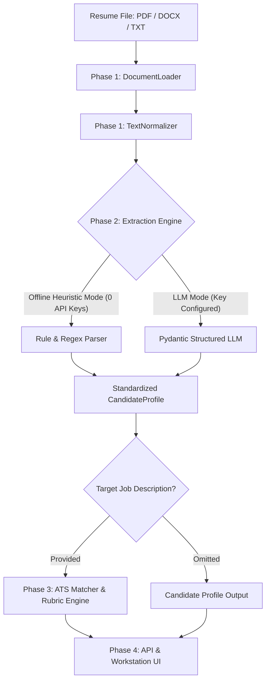

# ATS Resume Parser & Match Engine — Study Documentation

**Author & Creator:** saswa  
**Project:** Local-First ATS Resume Parser & Rubric Evaluation Engine  
**System Status:** `Phase 1: In Progress` | `Phase 2: Planned` | `Phase 3: Planned` | `Phase 4: Planned`

---

## 🧭 Master Phase Directory

This documentation is organized **strictly phase-wise** to provide a comprehensive, transparent understanding of the codebase. Each phase document provides both a **Layman's Analogy** (plain English, zero-jargon explanation) and an **In-Depth Technical Architecture Walkthrough**.

| Phase | Milestone Name | Key Objective & Description | Status | Reference Doc |
| :---: | :--- | :--- | :---: | :--- |
| **Phase 1** | **Core Document Ingestion & Text Normalizer** | Extract pristine text and identify structural sections from `.pdf`, `.docx`, and `.txt` files with zero data loss or encoding corruption. | `🟡 In Progress` | [phase-1.md](file:///c:/Users/saswa/Desktop/parse%20ATS/study_docs/phase-1.md) |
| **Phase 2** | **Candidate Entity Extraction Engine** | Convert unstructured resume text into a strongly typed `CandidateProfile` using deterministic offline regex heuristics + optional LLM adapters. | `⚪ Planned` | [phase-2.md](file:///c:/Users/saswa/Desktop/parse%20ATS/study_docs/phase-2.md) |
| **Phase 3** | **Rubric-Based ATS Matcher & Gap Analysis** | Evaluate candidate profiles against target job descriptions using weighted scoring (Skills 40%, Experience 35%, Education 15%, Quality 10%). | `⚪ Planned` | [phase-3.md](file:///c:/Users/saswa/Desktop/parse%20ATS/study_docs/phase-3.md) |
| **Phase 4** | **REST API & Anti-AI Slop Workstation UI** | FastAPI backend with `/parse`, `/score`, `/analyze` routes and an embedded, high-density dark-mode workstation testbench. | `⚪ Planned` | [phase-4.md](file:///c:/Users/saswa/Desktop/parse%20ATS/study_docs/phase-4.md) |

---

## 🏗️ High-Level System Architecture

---

## 📂 Source Code Layout

- `src/parser/`: Document reading (PyMuPDF, pdfplumber, python-docx) and text normalization.
- `src/engine/`: Heuristic parsing, token taxonomy, candidate extraction, and ATS rubric matcher.
- `src/core/`: Configuration, environmental settings, and provider abstractions.
- `src/api/`: REST routing, multipart file ingestion, and Pydantic schemas.
- `src/static/`: Embedded workstation UI (HTML5, Vanilla CSS, modern JavaScript).
