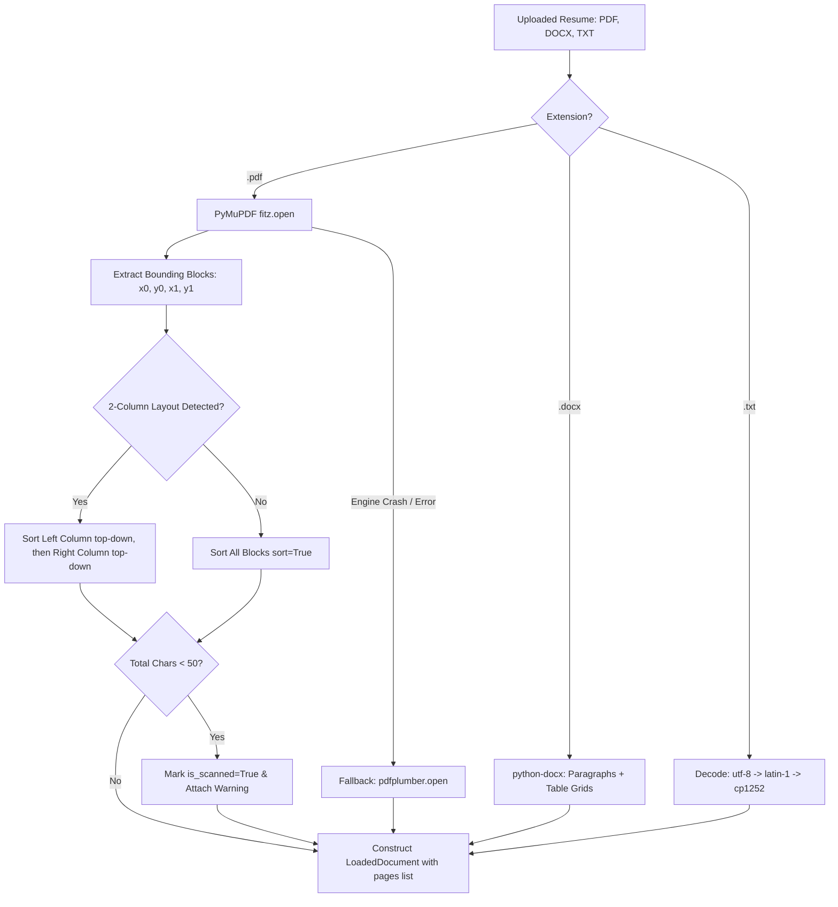

# Phase 1: Spatial & Layout-Aware Document Ingestion

**Author:** SazWhatician  
**Status:** `🟢 Completed & Upgraded`  
**Layer in System:** **Layer 1: Spatial & Layout Ingestion**  
**Core Files:** [`src/parser/loader.py`](file:///c:/Users/saswa/Desktop/parse%20ATS/src/parser/loader.py)

---

## 💡 Layman's Analogy (Explain Like I'm 5)

Imagine you open a newspaper or magazine. A modern newspaper doesn't write articles in one giant block stretching from the far left of the page to the far right. Instead, it has **two or three columns** side-by-side.

A human naturally reads the **left column top-to-bottom first**, and only then jumps over to the **right column**.

A naive computer program, however, reads PDFs like a laser scanner across the paper line-by-line horizontally:
```text
Left Column (Skills)             Right Column (Experience)
[Python, SQL]                    [Senior Engineer at Google]
[Docker, AWS]                    [Led team of 5 backend engineers]
```
The naive parser reads:  
> *"Python, SQL Senior Engineer at Google Docker, AWS Led team of 5 backend engineers"*

It turns the resume into complete **word salad**! 

**Phase 1 is your Spatial Layout Architect:**
1. It looks at the page in 2D space like human eyes do.
2. It detects if there is a sidebar on the left and a body on the right.
3. It reads the full left sidebar first, then the full right body, keeping work experience completely separate from skills.
4. If someone uploads a photocopied or scanned image without any real text, it immediately flags it as a scanned document instead of failing silently.

---

## 🎓 Computer Science Concepts Used

### 1. 2D Bounding-Box Spatial Clustered Partitioning
In PDF documents, characters don't have natural "newlines" or "paragraphs"—they are glyphs placed at floating-point Cartesian coordinates $(x_0, y_0, x_1, y_1)$ on a page canvas. 
- In [`src/parser/loader.py`](file:///c:/Users/saswa/Desktop/parse%20ATS/src/parser/loader.py), we utilize PyMuPDF (`fitz`) block geometry.
- We partition blocks into horizontal coordinate bands:
  - **Span Blocks** ($x_0 < 0.25W \land x_1 > 0.65W$): Full-width headers (candidate name, banner titles).
  - **Left Column Blocks** ($x_1 \le 0.48W$): Sidebars containing skills, contact chips, or languages.
  - **Right Column Blocks** ($x_0 \ge 0.35W$): Main body containing work history, bullet points, and education.
- Each partition is sorted topologically top-down by vertical coordinate $y_0$. This guarantees that 2-column Canva and LaTeX resumes are reassembled in true reading order.

### 2. Multi-Engine Fallback Pattern (Resilience Engineering)
In mission-critical production pipelines, a single library failure must never crash the service:
- **PyMuPDF (`fitz`)**: Primary engine written in C/C++. Parses pages in $<10\text{ms}$.
- **pdfplumber**: Fallback engine written in pure Python. Slower ($\sim 200\text{ms}$), but exceptionally tolerant of malformed xref tables and unusual font encodings.
- If PyMuPDF encounters a corrupt table, execution automatically cascades to `pdfplumber` without user-visible errors.

### 3. Sparse Document / Zero-Text Heuristic (Scanned PDF Detection)
If an image or scanned photograph of a resume is converted to PDF without Optical Character Recognition (OCR), standard text extraction returns an empty string or $<50$ random punctuation marks. 
- Phase 1 computes character density across pages:
  $$\text{is\_scanned} = (\text{total\_characters} < 50) \land (\text{page\_count} \ge 1)$$
- Flags `is_scanned = True` and stores `scanned_warning` in `LoadedDocument.metadata` so downstream extractors can alert recruiters.

---

## 📂 File-by-File Breakdown: `src/parser/loader.py`

| Function / Component | Input | Output | What It Does & Edge-Case Handled |
| :--- | :--- | :--- | :--- |
| `LoadedDocument` (Dataclass) | Raw document attributes | Data container | Stores `raw_text`, `page_count`, `pages: List[str]`, `is_scanned: bool`, and `metadata`. Preserves per-page text lists needed for Layer 2 packet splitting. |
| `DocumentLoader.load_file(path)` | File path string/Path | `LoadedDocument` | Universal disk loader. Validates file extension against `.pdf`, `.docx`, `.txt`. Raises clean 400 validation error if unsupported. |
| `DocumentLoader.load_bytes(data, filename)` | In-memory byte buffer | `LoadedDocument` | Universal streaming loader for multipart API uploads (FastAPI `UploadFile`). Avoids writing temporary files to disk. |
| `_extract_page_blocks_layout_aware(page)` | PyMuPDF `fitz.Page` | `str` | **The Core Spatial Algorithm**: Inspects block coordinates, clusters 2-column layouts, sorts top-down within columns, and joins blocks cleanly. |
| `_load_docx(path)` / `_load_docx_stream(stream)` | DOCX file or stream | `LoadedDocument` | Table-aware Word reader. Reads standard paragraphs **plus** all table cells, joining columns with ` \| ` delimiters so skills grids are never missed. |
| `_load_txt(path)` / `_load_txt_bytes(data)` | Plaintext bytes | `LoadedDocument` | Multi-encoding reader. Sequentially attempts `utf-8`, `utf-8-sig`, `latin-1`, and `cp1252` to prevent `UnicodeDecodeError`. |

---

## 🏗️ Architecture Flow Diagram



---

## 🚀 Skill-Up Takeaways for Your Career

1. **Never use raw string extraction on PDFs**: 
   Standard PDF text tools (`pypdf`, basic `fitz.get_text()`) read in PDF stream creation order, which scrambles multi-column resumes. Always use bounding-box spatial block clustering.
2. **Always separate stream inputs from disk inputs**:
   In cloud microservices, writing files to `/tmp` causes disk I/O bottlenecks. Supporting in-memory byte streams (`io.BytesIO`) allows horizontal scaling in serverless/Kubernetes environments.
3. **Graceful degradation over hard crashes**:
   Having PyMuPDF as the primary high-speed driver ($5\text{ms}$) with `pdfplumber` as fallback guarantees high availability without sacrificing raw performance.
