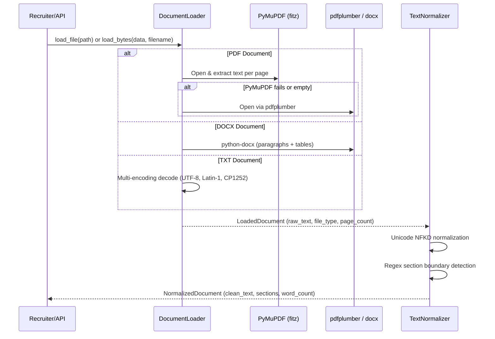

# Phase 1: Core Document Ingestion & Text Normalizer

**Author:** saswa  
**Status:** `🟢 Completed`  
**Focus:** File decoding, multi-engine PDF/Word/Text loading, text sanitization, and section segmentation.

---

## 💡 Layman's Analogy (Explain Like I'm 5)

Imagine you run a busy hiring office. Job applicants hand you resumes in all shapes and sizes: some are glossy PDF brochures with fancy dual-column designs, some are Microsoft Word files, and others are simple notepad text files.

If you handed those straight to an executive or an AI without prepping them, they'd get confused by strange formatting, weird font symbols (like bullet circles that turn into gibberish boxes), or words crammed together across multiple columns.

**Phase 1 is your smart, ultra-fast Digital Mailroom Clerk:**
1. It takes any document (`.pdf`, `.docx`, or `.txt`).
2. It irons out all the wrinkles: it fixes non-standard spaces, converts odd bullet symbols into clean dashes, and removes empty space.
3. It uses a highlighter to organize the resume into labeled folders: **Summary**, **Experience**, **Education**, **Skills**, **Projects**, and **Certifications**.

When Phase 1 finishes its job, what comes out is clean, organized, predictable text that anyone can read.

---

## 🛠️ Technical Architecture & Engineering Deep Dive

Phase 1 provides two decoupled, resilient modules:
1. `DocumentLoader` (`src/parser/loader.py`): Multi-strategy file ingestion engine.
2. `TextNormalizer` (`src/parser/normalizer.py`): Deterministic text sanitizer and structural section segmenter.



---

## 📄 File Breakdown & Responsibilities

### 1. `src/parser/loader.py`
- **Layman summary**: The universal reader that knows how to open and read PDFs, Word docs, and text files without crashing.
- **Technical specifications**:
  - **Multi-Engine PDF Extraction**: Uses PyMuPDF (`fitz`) as the high-speed primary parser ($<50\text{ms}$ per resume). Automatically degrades gracefully to `pdfplumber` if font encoding or corrupt xref tables are encountered.
  - **Table-Aware DOCX Parsing**: Uses `python-docx` to iterate through both standard body paragraphs and table rows/cells, joining table columns with ` | ` delimiters so education tables or skill grids are never dropped.
  - **Encoding-Tolerant TXT Reader**: Tries `utf-8`, `utf-8-sig`, `latin-1`, and `cp1252` consecutively, ensuring old Windows/Mac text files open without throwing `UnicodeDecodeError`.
  - **Dual API**: Supports both `load_file(path)` for local disk files and `load_bytes(data, filename)` for streaming multipart web uploads.

### 2. `src/parser/normalizer.py`
- **Layman summary**: The cleaner that sweeps away weird characters, fixes spacing, and slices the text into clear sections.
- **Technical specifications**:
  - **Unicode Normalization (`NFKD`)**: Decomposes typographic ligatures (such as `fi`, `fl`, `ae`) and cleans accent marks into standard ASCII-compatible representations.
  - **Control Character & Whitespace Sanitization**: Translates non-breaking spaces (`\xa0`) and Windows carriage returns (`\r\n`) to standard Unix linebreaks (`\n`), collaping redundant blank line runs to a maximum of 2.
  - **Bullet Normalization**: Replaces various Unicode bullet codepoints (`\u2022`, `\u25CF`, etc.) with standardized markdown dashes (`\n- `).
  - **Section Segmentation State Machine**: Evaluates lines using case-insensitive regex patterns bounded by line length ($\le 40$ characters) to isolate standard headers:
    - `summary`: "Professional Summary", "Career Profile", "About Me".
    - `experience`: "Work Experience", "Employment History", "Professional Background".
    - `education`: "Academic Background", "Education & Credentials".
    - `skills`: "Technical Skills", "Core Competencies", "Technologies".
    - `projects`: "Key Projects", "Selected Projects".
    - `certifications`: "Licenses & Certifications", "Accreditations".
  - **DoS & Memory Protection**: Caps maximum character length to 50,000 characters by default to protect downstream scoring algorithms from memory exhaustion attacks.

---

## 🧪 Verification & How to Test This Phase

To verify that document ingestion and normalization are operating with 100% test coverage:

```bash
python -m pytest tests/test_loader.py -v
```

**Test Coverage Criteria:**
- Verifies plain text file reading with metadata verification.
- Verifies in-memory byte buffer ingestion (for web API parity).
- Verifies error handling when an unsupported file extension (`.xyz`) is supplied.
- Verifies normalization cleans dirty whitespace, non-breaking spaces, and properly extracts `experience`, `skills`, and `education` dictionary keys.
- Verifies empty string handling does not raise exceptions.
