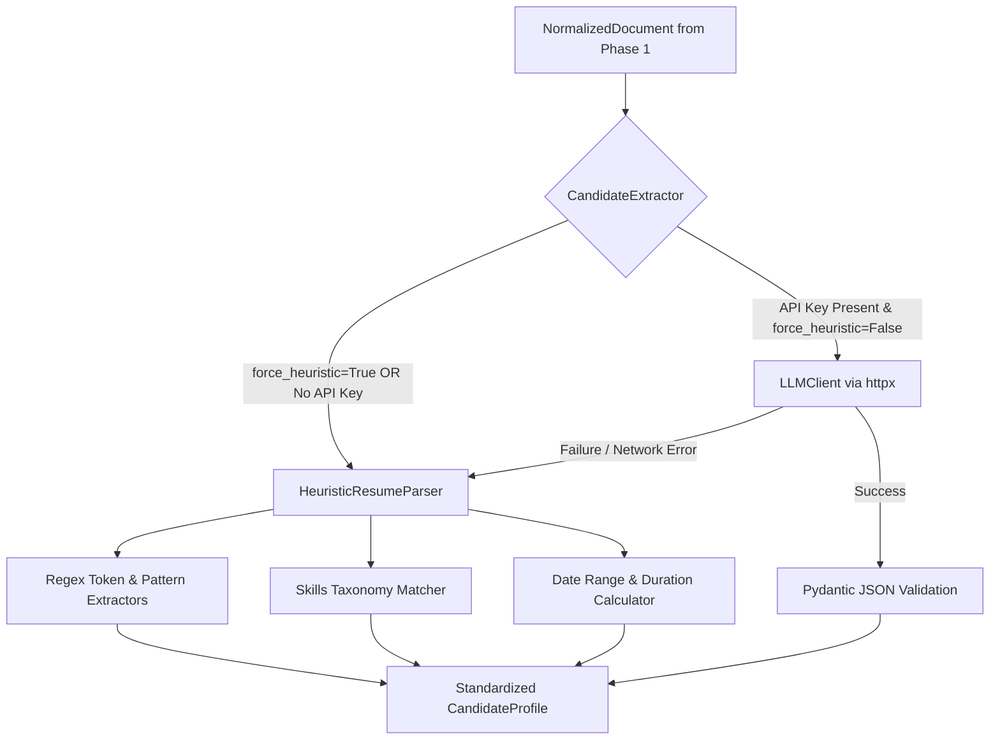

# Phase 2: Candidate Entity Extraction Engine

**Author:** saswa  
**Status:** `🟢 Completed`  
**Focus:** Transforming unstructured resume text into a strongly typed `CandidateProfile` using offline heuristics + optional LLM adapters.

---

## 💡 Layman's Analogy (Explain Like I'm 5)

Imagine you are looking at a printout of a resume. Your eyes automatically jump around:
- You look at the very top for the candidate's **Name**, **Email**, and **Phone Number**.
- You look for their **Skills** section to see what tools they know.
- You look at their **Work Experience** to see where they worked and for how many years.
- You check their **College / Degree**.

Now imagine you have to do this for 1,000 resumes an hour without getting tired.

**Phase 2 is your Expert Sifting Engine:**
- It has an **Offline Detective Brain (Heuristics)**: Even if your internet is completely disconnected and you have no AI keys, it knows exact patterns (like what an email looks like, what an Indian or US phone number looks like, and has an exhaustive encyclopedia of 200+ tech skills from Python to Kubernetes). It extracts all details in less than 5 milliseconds!
- It has an **AI Brain (LLM Adapter)**: If you provide an API key (like Gemini or OpenRouter), it can also read nuanced paragraphs, summarize achievements, and extract non-standard resume formats with AI. If the AI ever goes down or runs out of credits, it automatically falls back to the Offline Detective so your application never crashes.

---

## 🛠️ Technical Architecture & Engineering Deep Dive

Phase 2 takes the `NormalizedDocument` from Phase 1 and converts it into a valid `CandidateProfile` Pydantic model.



---

## 📄 File Breakdown & Responsibilities

### 1. `src/engine/heuristics.py`
- **Layman summary**: The offline rulebook that detects emails, phone numbers, tech skills, and dates without needing AI or internet.
- **Technical specifications**:
  - **Deterministic Contact Extraction**:
    - Email: `\b[A-Za-z0-9._%+-]+@[A-Za-z0-9.-]+\.[A-Z|a-z]{2,}\b`.
    - Phone: Matches 10-14 digit international E.164 formats as well as US formatted numbers `(123) 456-7890`.
    - Social links: Extracts `linkedin.com/in/*` and `github.com/*`.
  - **Curated Skills Taxonomy**: Categorizes skills into:
    - *Languages* (Python, TypeScript, Go, Rust, Java, etc.)
    - *Frameworks* (FastAPI, React, Django, Vue, Spring, etc.)
    - *Databases* (PostgreSQL, MongoDB, Redis, Snowflake, etc.)
    - *Cloud & DevOps* (Docker, Kubernetes, AWS, Terraform, CI/CD, etc.)
    - *Tools & Practices* (Git, Kafka, REST APIs, Microservices, TDD)
  - **Case-Insensitive Word Boundary Matching**: Employs negative lookbehind/lookahead `(?<![\w#+])skill(?![\w#+])` to prevent false positive substrings (e.g. preventing `c` from falsely matching `cat`).
  - **Chronological Experience Parser**: Extracts employment periods (`YYYY - YYYY` or `Month YYYY - Present`), parses role and company titles, and calculates total professional career tenure.
  - **Academic Degree Recognizer**: Detects degrees (`B.S.`, `M.S.`, `B.Tech`, `Ph.D.`, `MBA`) and university institution names.

### 2. `src/core/llm.py`
- **Layman summary**: The lightweight AI communicator that speaks to OpenRouter, Google Gemini, or OpenAI when an API key is available.
- **Technical specifications**:
  - Direct HTTP communication using `httpx` (no bloated langchain dependency chains).
  - Enforces JSON schema response formats (`response_format: {"type": "json_object"}`).
  - Centralized error handling returning `None` instead of raising uncaught server exceptions.

### 3. `src/engine/extractor.py`
- **Layman summary**: The coordinator that chooses between the offline rules and the AI based on whether an API key exists.
- **Technical specifications**:
  - Coordinates fallback priority: `LLM -> Heuristic`.
  - Handles Pydantic validation into `CandidateProfile`.

---

## 🧪 Verification & How to Test This Phase

Run the Phase 2 test suite:

```bash
python -m pytest tests/test_extractor.py -v
```

**Test Coverage Criteria:**
- Verifies full entity extraction from a realistic software engineer resume.
- Verifies candidate name, email, phone, GitHub, and LinkedIn detection.
- Verifies extraction of categorized skills (Python, FastAPI, Docker).
- Verifies parsing of work experience records and education credentials.
- Verifies safe handling of empty or blank resumes without runtime errors.
