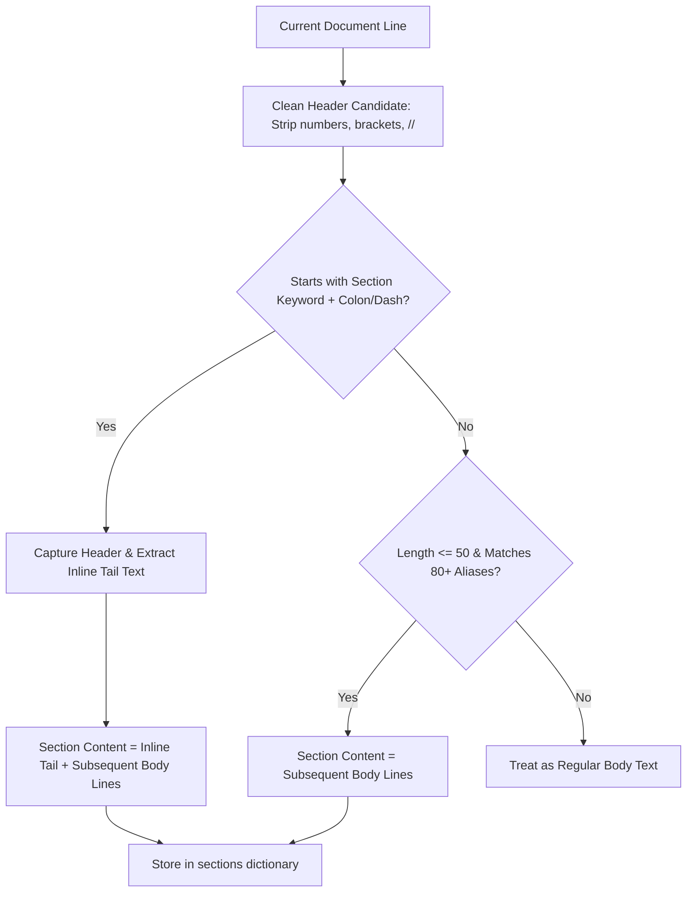

# Phase 3: Typographic & Fuzzy Section Normalizer & International Heuristics

**Author:** SazWhatician  
**Status:** `🟢 Completed & Upgraded`  
**Layer in System:** **Layer 3: Fuzzy & Typographic Section Boundary Detection**  
**Core Files:** [`src/parser/normalizer.py`](file:///c:/Users/saswa/Desktop/parse%20ATS/src/parser/normalizer.py), [`src/engine/heuristics.py`](file:///c:/Users/saswa/Desktop/parse%20ATS/src/engine/heuristics.py)

---

## 💡 Layman's Analogy (Explain Like I'm 5)

Imagine you are reading books from authors all around the world.
- One author labels their chapter: `CHAPTER 1: MY LIFE`
- Another author writes: `01 | Where I've Journeyed`
- A French author writes: `Expérience Professionnelle`
- Another writes: `Experience: Senior Engineer at Uber from 2020 to 2024` on a single line!

If you tell a computer: *"Only look for lines that say exact words 'Work Experience' and nothing else,"* the computer will fail on 70% of real-world resumes! It won't find their experience, will assume the candidate has zero years of work, and reject them!

Furthermore, what if a candidate's name is **José Müller** or **Kavya N. Rao**?
If your computer program only accepts standard English A-Z letters, it treats `é` and `ü` as alien corruption and deletes the candidate's name!

**Phase 3 is your Polyglot Stylist & Forensic Normalizer:**
1. It knows **80+ multilingual and creative ways** people title sections (including *"Tech Stack"*, *"Ausbildung"*, *"01 | EXPERIENCE"*).
2. It strips away decorative brackets `[ ]`, hashes `##`, and numbers `01 |` to find the true underlying section intent.
3. It handles **inline headers** where the candidate started typing on the same line as the header.
4. It speaks international Unicode fluently, correctly honoring accented names, honorific initials, and global phone numbers.

---

## 🎓 Computer Science Concepts Used

### 1. Unicode Normalization: NFC (Composition) vs. NFKD (Decomposition)
One of the most insidious bugs in text engineering occurs with Unicode encodings:
- Under **NFKD** (Compatibility Decomposition), the accented letter `é` (U+00E9) is decomposed into two distinct code points: the base Latin letter `e` (U+0065) followed by a **Combining Acute Accent** `´` (U+0301).
- When a regex like `r"^[A-Za-zÀ-ÖØ-öø-ÿ]+$"` inspects decomposed text, the combining mark `\u0301` fails to match the character class, causing names like **José Müller** to be rejected as invalid!
- **The Solution**: In [`src/parser/normalizer.py`](file:///c:/Users/saswa/Desktop/parse%20ATS/src/parser/normalizer.py), we replace typographic ligatures (`fi` $\rightarrow$ `fi`) and enforce **NFC (Canonical Composition)**. In NFC, `é` and `ü` remain precomposed atomic single characters that match standard international alphabet ranges.

### 2. Fuzzy Pattern Matching with Bounded Word Boundaries
Section titles are rarely clean. They are surrounded by decorative numbers and ASCII borders:
```text
// 02. TECHNICAL SKILLS & PROFICIENCIES //
[ TECH STACK & TOOLS ]
## WORK EXPERIENCE (2018 - Present)
```
- Phase 3 utilizes a two-tier normalization pipeline:
  1. **Header Candidate Sanitization**: Strips markdown hashes `^#+`, numeric prefixes `^\d+[\s.)|/-]+`, slashes `\/\/`, and brackets `[\](){}]`.
  2. **Bounded Regex Matching**: Rather than exact equality `^pattern$`, it uses bounded word matching `rf"(?:^|\b){pat}(?:\b|$)"` against an encyclopedia of 80+ aliases.

### 3. Inline Header Disambiguation (Tail Preservation)
Candidates often write headers followed immediately by body content on the identical line:
```text
Experience: Senior Software Engineer at Meta from 2021 to 2024
```
- If treated as a standalone header, the remainder of the line is lost because section body parsing normally begins on `line_index + 1`.
- Phase 3 checks the **inline header pattern first**:
  $$\text{regex} = \text{rf"}\verb|^[\s#*=-]*(?:{pat})[:\s|-]+(.+)$|\text{"}$$
- It extracts the `inline_tail` and prepends it to the section's line stream, ensuring zero data loss.

### 4. International Phone & Adaptive Date Regex Machines
- **Global Phone Parsing**: Accommodates international ITU E.164 formats, European spaced dial codes (`+49 30 12345678`), UK codes (`(+44) 20 7946 0958`), and Indian mobiles (`+91 98765 43210`).
- **Adaptive Date Ranges**: Accommodates quarter notation (`Q3 2021`), month abbreviations (`Jan 2020 - Dec 2022`), dashed years (`2019 - 2023`), and present indicators (`Current`, `Ongoing`, `Now`).

---

## 📂 File-by-File Breakdown

### 1. `src/parser/normalizer.py`
| Function / Component | Input | Output | What It Does & Edge-Case Handled |
| :--- | :--- | :--- | :--- |
| `NormalizedDocument` | Cleaned text, section dict | Data container | Stores `clean_text`, `sections: Dict[str, str]`, `word_count`, and `char_count`. |
| `TextNormalizer.normalize(text)` | Raw text string | `NormalizedDocument` | Expands ligatures, applies NFC normalization, standardizes bullets to `- `, removes excessive blank lines, and extracts sections. |
| `_clean_header_candidate(line)` | Raw candidate line | Sanitized string | Strips decorative numbers (`01 |`), brackets, and markdown symbols to reveal the core header phrase. |
| `_extract_sections(text)` | Cleaned document text | `Dict[str, str]` | Evaluates lines against 80+ aliases. Disambiguates inline headers from standalone headers and aggregates sections. |

### 2. `src/engine/heuristics.py`
| Function / Component | Input | Output | What It Does & Edge-Case Handled |
| :--- | :--- | :--- | :--- |
| `HeuristicResumeParser.parse(doc)` | `NormalizedDocument` | `CandidateProfile` | Coordinates 100% offline extraction with zero external API calls in $<15\text{ms}$. |
| `_extract_contact_info(text)` | Text string | `ContactInfo` | Extracts international names (accented letters, honorifics), regex-verified emails, international phones, and LinkedIn/GitHub links. |
| `_extract_skills(text, section)` | Text & skills section | `Tuple[List[str], Dict]` | Matches against 200+ technology taxonomy tokens across Languages, Frameworks, Databases, Cloud, and Tools. |
| `_extract_experience(text, section)` | Text & exp section | `Tuple[List, float]` | Extracts company, role, date ranges, and bullet highlights; computes total tenure math across all career milestones. |

---

## 🏗️ Section Extraction Flow Diagram



---

## 🚀 Skill-Up Takeaways for Your Career

1. **Be forensic about Unicode normalization forms**:
   Always understand whether your text pipeline is using **NFC** or **NFKD**. Using the wrong normalization form will silently break regex tokenizers, dictionary lookups, and database queries on international names.
2. **Never assume English-only conventions**:
   In enterprise software, candidates submit resumes in French, German, Spanish, and regional conventions. Building a multi-alias taxonomy prevents artificial rejections of top global talent.
3. **Precedence matters in parsing**:
   Always evaluate specific inline patterns (`Skills: Python...`) before broad standalone patterns (`Skills`). Evaluating broad patterns first causes tail content on the same line to be dropped.
