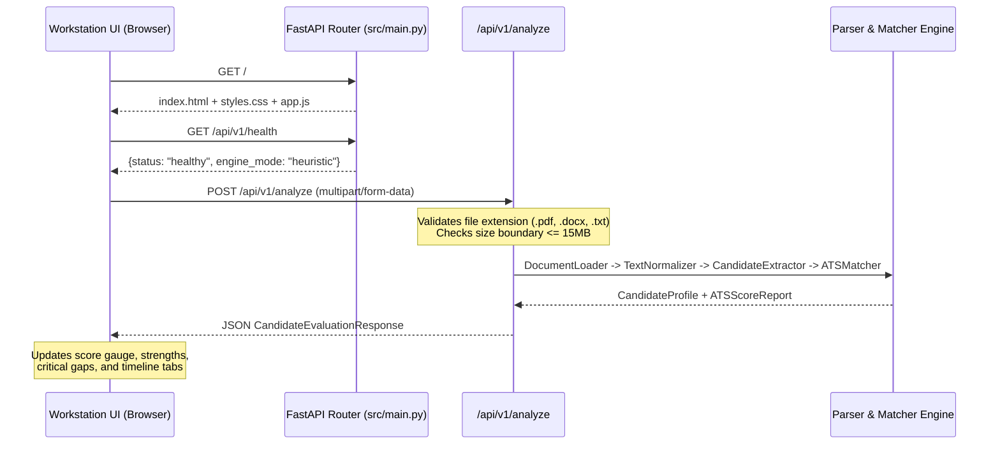

# Phase 4: REST API Endpoints & Anti-AI Slop Workstation UI

**Author:** saswa  
**Status:** `🟢 Completed`  
**Focus:** FastAPI service architecture, multipart file streaming, system diagnostics, and the embedded dark-mode technical workstation interface.

---

## 💡 Layman's Analogy (Explain Like I'm 5)

Imagine you built a state-of-the-art engine inside a workshop. The engine runs smoothly, but right now nobody can use it unless they open the hood and manually attach wires.

To turn this into a product you can actually test and show to anyone:
1. You build a **Drive-Through Counter (The REST API)**: Any computer or mobile app can send a resume file to your counter, and in a fraction of a second, your counter hands back a clean, organized JSON receipt containing the candidate's skills, experience, and job match score.
2. You build a **Cockpit Dashboard (The Workstation UI)**: Instead of generic, bloated software filled with purple gradient buzzwords, you have a high-density, dark-mode technical control screen. You can drag and drop a resume, pick sample job descriptions with one click, run evaluations using `Ctrl+Enter`, switch between tabs (work history, categorized skills, education), and copy formatted JSON with one click.

---

## 🛠️ Technical Architecture & Client-Server Mechanics

Phase 4 exposes the core parser and matcher through asynchronous FastAPI routes and serves an embedded client app directly from memory.



---

## 📄 File Breakdown & Responsibilities

### 1. `src/main.py`
- **Layman summary**: The front door that starts up the server and hooks everything together.
- **Technical specifications**:
  - Initializes FastAPI application with automatic OpenAPI `/docs` and `/redoc` documentation.
  - Implements CORS middleware allowing local browser development (`allow_origins=["*"]`).
  - Registers execution latency middleware measuring wall-clock duration and appending `X-Process-Time` HTTP headers.
  - Mounts static directory at `/static` and binds root path `/` to return `src/static/index.html`.

### 2. `src/api/routes/parser.py`
- **Layman summary**: The API endpoints that accept uploaded files and return structured results.
- **Technical specifications**:
  - `POST /api/v1/parse`: Ingests resume file; extracts `CandidateProfile`.
  - `POST /api/v1/score`: Accepts JSON payload containing pre-parsed `CandidateProfile` and `job_description`; returns `ATSScoreReport`.
  - `POST /api/v1/analyze`: Combined one-shot endpoint accepting multipart resume file upload and optional job description form parameter; runs full pipeline and returns `CandidateEvaluationResponse`.
  - Input validation: Rejects unsupported file extensions with HTTP 415 and files exceeding 15MB with HTTP 413.

### 3. `src/api/routes/health.py`
- **Layman summary**: The status light that tells you if the system is running and which engine mode is active.
- **Technical specifications**:
  - `GET /api/v1/health`: Returns active engine mode (`heuristic` vs `llm`), author (`saswa`), and supported file types.

### 4. `src/static/index.html`, `styles.css`, `app.js`
- **Layman summary**: The interactive workstation where you drag-and-drop resumes, test different jobs, and inspect the scores and profile.
- **Technical specifications**:
  - **Zero Build Toolchain**: Plain HTML5, Modern Vanilla CSS, and ES6 JavaScript. No `npm`, `node_modules`, or complex build bundlers required.
  - **Anti-AI Slop Aesthetic**: High data-density dark theme using a slate/zinc color palette (`#080c14`, `#131b2e`), crisp 1px borders, and monospace JetBrains typography for data metrics.
  - **Interactive Presets**: Quick-load buttons for *Backend Lead*, *Frontend Eng*, and *ML Specialist*.
  - **Dynamic Tab Switching**: Smooth client-side tab panes for *Work Experience Timeline*, *Categorized Skills*, *Education History*, and *Raw JSON Viewer*.
  - **Telemetry**: Displays real-time API response time in milliseconds and engine mode used.

---

## 🧪 Verification & How to Test This Phase

Run the Phase 4 test suite:

```bash
python -m pytest tests/test_api.py -v
```

**Test Coverage Criteria:**
- Verifies `GET /api/v1/health` returns HTTP 200 with `status: healthy` and author credit `saswa`.
- Verifies `POST /api/v1/parse` parses text resume and returns extracted profile.
- Verifies `POST /api/v1/analyze` computes overall match score and matches technical skills against target JD.
- Verifies unsupported file extensions (`.exe`) are rejected with HTTP 415.
- Verifies root endpoint `GET /` serves HTML workstation webpage.
