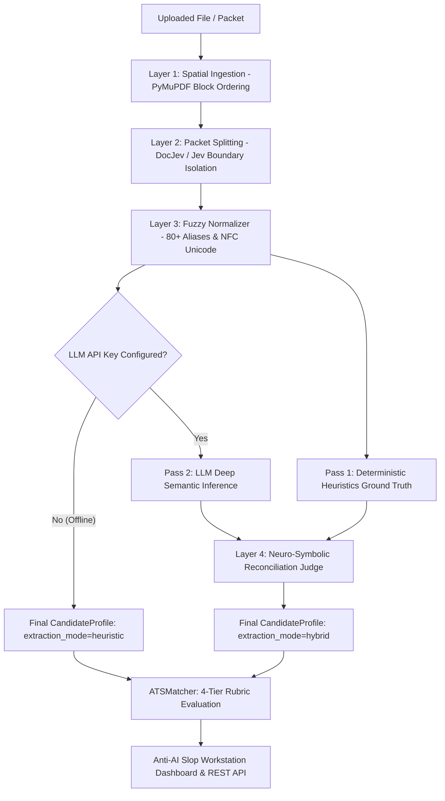

# Phase 4: Neuro-Symbolic Hybrid Extraction, Rubric Matching & Workstation UI

**Author:** SazWhatician  
**Status:** `🟢 Completed & Upgraded`  
**Layer in System:** **Layer 4: Hybrid Extraction & Reconciliation Engine + REST Workstation**  
**Core Files:** [`src/engine/extractor.py`](file:///c:/Users/saswa/Desktop/parse%20ATS/src/engine/extractor.py), [`src/engine/matcher.py`](file:///c:/Users/saswa/Desktop/parse%20ATS/src/engine/matcher.py), [`src/api/routes/parser.py`](file:///c:/Users/saswa/Desktop/parse%20ATS/src/api/routes/parser.py), [`src/static/`](file:///c:/Users/saswa/Desktop/parse%20ATS/src/static/)

---

## 💡 Layman's Analogy (Explain Like I'm 5)

Imagine you are solving a complex criminal investigation:
- On one side, you have a **Forensic Scientist**: They don't speculate. They check fingerprints, exact phone numbers, and physical evidence. If an email address isn't physically printed on the paper, they will never make one up.
- On the other side, you have a **Seasoned Detective**: They understand human psychology, read between the lines, and can connect the dots in a messy story (e.g. recognizing that someone who *"built high-throughput distributed pipelines on AWS"* is an experienced cloud architect, even if they forgot to write the word *"Cloud"* in their skills list).

If you only use the scientist, you miss the rich human story.  
If you only use the detective, they might occasionally hallucinate or misremember a phone number.

**Phase 4 is the Neuro-Symbolic Super-Team:**
1. It runs the **Forensic Scientist (Deterministic Heuristics)** to lock down verified facts: real email addresses, exact international phone numbers, verified social links, and taxonomy keywords.
2. It runs the **Seasoned Detective (LLM Semantic Reasoning)** to extract messy narrative job histories, understand project achievements, and uncover implicit skills.
3. It runs a **Reconciliation Judge**: It fuses both outputs together! If the AI hallucinated an email not on the page, the judge throws it out and restores the real one. If the AI discovered an unlisted skill from a project paragraph, the judge merges it in.
4. It compares the candidate to your Job Description using a **4-Tier Mathematical Rubric**, and presents the results on a **high-density, dark-mode workstation dashboard**.

---

## 🎓 Computer Science Concepts Used

### 1. Neuro-Symbolic AI Fusion (Reconciliation Architecture)
Pure statistical AI (LLMs) suffers from hallucinations and nondeterminism. Pure symbolic AI (regex, rule engines) is brittle and fails on novel narrative formats.
- **Neuro-Symbolic Fusion** merges the precision of symbolic rules with the cognitive generalization of neural networks:
  $$\text{Profile}_{\text{Final}} = \text{Reconcile}\left(\text{Profile}_{\text{Symbolic (Heuristic)}}, \text{Profile}_{\text{Neural (LLM)}}\right)$$
- In [`src/engine/extractor.py`](file:///c:/Users/saswa/Desktop/parse%20ATS/src/engine/extractor.py#L104-L188):
  - **Ground-Truth Contact Verification**: If the LLM produces an email string $E$, the reconciler checks if $E \in \text{clean\_text}$. If not, it falls back to the regex-verified email, mathematically preventing contact hallucinations.
  - **Skill Set Union**: Computes the union $\mathcal{S}_{\text{LLM}} \cup \mathcal{S}_{\text{Heuristic}}$, preserving proper title casing (e.g. "FastAPI", "PostgreSQL") while deduplicating case-insensitively.
  - **Narrative Enrichment**: Takes the LLM's parsed bullet points, company titles, and timeline summaries, but fills missing tenures using heuristic date math.

### 2. 4-Tier Rubric-Based ATS Scoring Algorithm
Rather than asking an LLM for an arbitrary "1 to 10" rating (which drifts wildly between runs), [`src/engine/matcher.py`](file:///c:/Users/saswa/Desktop/parse%20ATS/src/engine/matcher.py) computes a mathematically deterministic ATS score:

$$\text{Overall ATS Score} = \sum_{i \in \{\text{tech}, \text{exp}, \text{edu}, \text{qual}\}} (w_i \cdot S_i)$$

| Category | Weight ($w_i$) | Algorithmic Evaluation |
| :--- | :---: | :--- |
| **Technical Skills** | **40%** | Jaccard & taxonomy overlap between required job skills and candidate skill profile. |
| **Experience & Role Relevance** | **35%** | Candidate tenure vs. required minimum years + semantic domain title alignment. |
| **Academic Credentials** | **15%** | Degree tier validation (Doctorate > Master's > Bachelor's > Associate). |
| **Presentation & Quality** | **10%** | Contact completeness (email, phone, LinkedIn/GitHub) + quantifiable bullet metrics. |

### 3. Asynchronous Streaming Architecture (Zero-Disk I/O)
- Uses FastAPI with `async/await` to handle streaming multipart file uploads directly in RAM via `io.BytesIO`.
- Enforces strict security boundaries:
  - 15 MB file size limit (`HTTP_413_REQUEST_ENTITY_TOO_LARGE`).
  - Strict extension whitelisting (`HTTP_415_UNSUPPORTED_MEDIA_TYPE`).

---

## 📂 File-by-File Breakdown

### 1. `src/engine/extractor.py`
| Function / Component | Input | Output | What It Does & Edge-Case Handled |
| :--- | :--- | :--- | :--- |
| `CandidateExtractor.extract(doc)` | `NormalizedDocument` | `CandidateProfile` | **The Hybrid Coordinator**: Runs heuristic ground-truth pass; runs LLM pass if API key is configured; invokes `_reconcile` to merge both. |
| `_extract_with_llm(doc)` | `NormalizedDocument` | `Optional[CandidateProfile]` | Sends structured Pydantic schema prompt to configured provider (Gemini, OpenRouter, OpenAI) with strict temperature ($0.1$). |
| `_reconcile(heuristic, llm, doc)` | Heuristic profile, LLM profile, Doc | `CandidateProfile` | **The Reconciliation Judge**: Verifies emails/phones against raw text; merges skill taxonomies; prevents hallucination; marks `extraction_mode="hybrid"`. |

### 2. `src/engine/matcher.py`
| Function / Component | Input | Output | What It Does & Edge-Case Handled |
| :--- | :--- | :--- | :--- |
| `ATSMatcher.evaluate(profile, jd)` | CandidateProfile, Job Description | `ATSScoreReport` | Calculates the 4-tier rubric weights; synthesizes Key Strengths, Critical Gaps, and Recruiter Recommendation. |

### 3. `src/api/routes/parser.py`
| Endpoint | Method | Payload | Description |
| :--- | :---: | :--- | :--- |
| `/api/v1/split` | `POST` | `multipart/form-data` | Uploads bundled application packets; returns classified sub-document segments and page cuts (DocJev & Heuristic). |
| `/api/v1/parse` | `POST` | `multipart/form-data` | Ingests document or packet; splits and isolates resume; normalizes; extracts candidate profile. |
| `/api/v1/score` | `POST` | `application/json` | Evaluates an already parsed `CandidateProfile` against a target job description. |
| `/api/v1/analyze` | `POST` | `multipart/form-data` | **The Full 4-Layer Pipeline**: Ingestion $\rightarrow$ Split $\rightarrow$ Normalize $\rightarrow$ Hybrid Extract $\rightarrow$ Rubric Match. |
| `/api/v1/health` | `GET` | Empty | Returns diagnostics, active engine mode (`heuristic`, `llm`, or `hybrid`), and status of all 4 layers. |

---

## 🏗️ End-to-End System Pipeline Flow

---

## 🚀 Skill-Up Takeaways for Your Career

1. **Neuro-Symbolic architecture beats pure LLMs every time**:
   Never trust an LLM with critical deterministic identifiers (emails, phone numbers, legal IDs, credit cards). Always use deterministic regex to anchor ground-truth facts, and use LLMs for semantic narrative understanding.
2. **Explainable AI (XAI) over black-box scores**:
   Hiring platforms and ATS systems face strict regulatory scrutiny (e.g. EEOC and EU AI Act). A deterministic, weighted rubric (Skills 40%, Experience 35%, Education 15%, Quality 10%) with explicit gap breakdowns is fully audit-compliant, whereas an LLM saying *"I give this candidate a 7/10"* is indefensible.
3. **Build zero-npm embedded dashboards**:
   You do not need a 400MB `node_modules` folder, Webpack, or Next.js just to build an internal test bench. A single `index.html` + `styles.css` + `app.js` bundle served directly from FastAPI starts in milliseconds, uses 0MB of build memory, and never breaks due to npm dependency deprecations.
